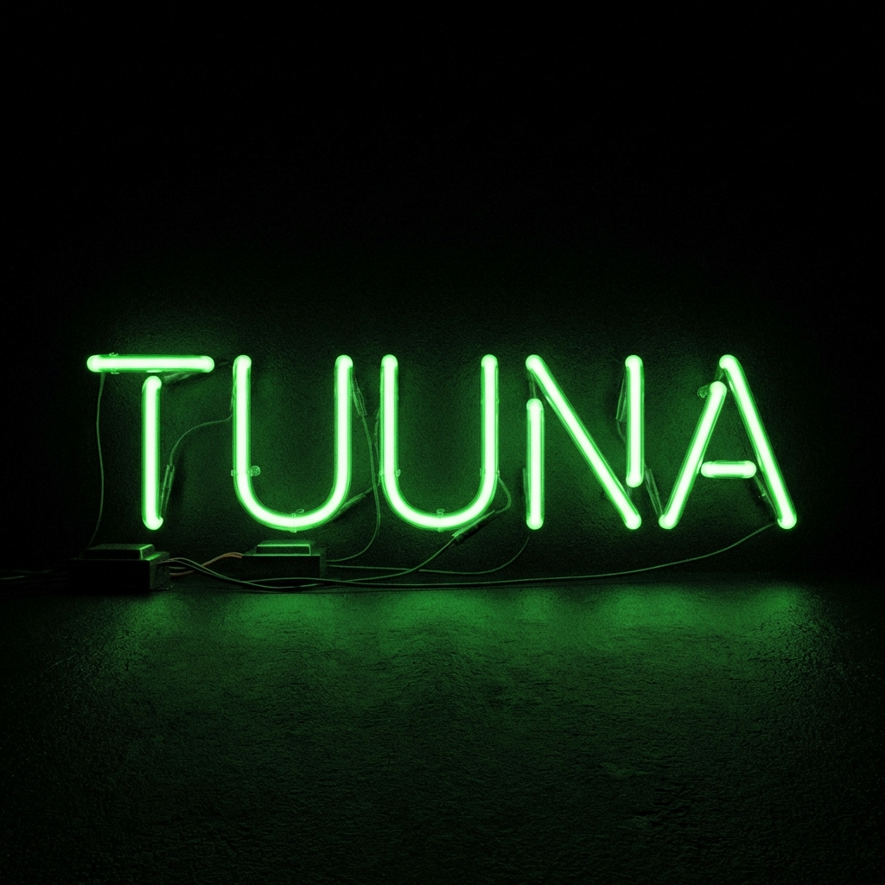

<!-- HEADER & LOGO -->
<div align="center">
  
  <a href="https://github.com/Yashuu213/Tuuna-Ai-Agent">
    
  </a>

  <br />

  <!-- STATUS BADGES -->
  
  
  
  
  
  <br />
  <br />

  <!-- PLATFORM BADGES -->
  <a href="#-downloads">
    
    
    
  </a>

  <br />
  <br />

  <p align="center">
    <b>☣️ AUTONOMOUS CYBERNETIC ENTITY // CROSS-PLATFORM EDITION ☣️</b>
    <br />
    <span style="color: #888; font-family: monospace;">[ 👁️ OMNI-VISION ] • [ 🧠 HYPER-REASONING ] • [ ⚡ NATIVE APP MODE ]</span>
  </p>
</div>

---

<div align="center">
  
</div>

<br />

# ⚡ SYSTEM OVERRIDE INITIATED

> **"Tuuna is not just an AI. It is an extension of your will."**

It tears through the fabric of your Operating System (**Windows, Mac, or Linux**), seizing control of the mouse, keyboard, and visual feed to execute tasks with ruthless precision. From automating job applications to coding its own upgrades, Tuuna is the **Level 5 Agent** you've been waiting for.

---

### 🟢 OPTION 1: THE EXECUTABLE (Direct Download)
*Click your OS logo below to acquire the weapon.*

| **PLATFORM** | **STATUS** | **DIRECT LINK** |
| :---: | :---: | :---: |
| <br>**WINDOWS** | 🟢 **ONLINE** | [**📥 DOWNLOAD .EXE**](https://github.com/Yashuu213/Tunna-multiSystem-AI/releases/latest/download/Tuuna-Agent-Windows.zip) |
| <br>**MACOS** | 🟢 **ONLINE** | [**📥 DOWNLOAD .APP**](https://github.com/Yashuu213/Tunna-multiSystem-AI/releases/latest/download/Tuuna-Agent-macOS.zip) |
| <br>**LINUX** | 🟢 **ONLINE** | [**📥 DOWNLOAD BINARY**](https://github.com/Yashuu213/Tunna-multiSystem-AI/releases/latest/download/Tuuna-Agent-Linux.zip) |

#### ⚠️ ACTIVATION PROTOCOLS (READ CAREFULLY)

<details>
<summary><b>🪟 WINDOWS USERS</b></summary>
<blockquote>
1. Download <b>Tuuna-Agent-Windows.zip</b>.<br>
2. Right-Click > <b>Extract All</b>.<br>
3. Open folder and double-click <b>Tuuna_AI_Agent.exe</b>.<br>
4. <i>If Windows Defense blocks it: Click "More Info" > "Run Anyway".</i> (We are too powerful for them).
</blockquote>
</details>

<details>
<summary><b>🍎 MAC USERS</b></summary>
<blockquote>
1. Download <b>Tuuna-Agent-macOS.zip</b>.<br>
2. Double-click to unzip.<br>
3. <b>Right-Click</b> the App > Select <b>Open</b> (This bypasses Apple's Gatekeeper).<br>
4. Grant Permissions (Accessibility/Screen Recording) when asked. Tuuna needs eyes to see.
</blockquote>
</details>

<details>
<summary><b>🐧 LINUX USERS</b></summary>
<blockquote>
1. Download <b>Tuuna-Agent-Linux.zip</b>.<br>
2. Extract the archive.<br>
3. Open Terminal in that folder.<br>
4. Run: <code>chmod +x Tuuna_AI_Agent</code> then <code>./Tuuna_AI_Agent</code>.
</blockquote>
</details>

### 🟡 OPTION 2: THE SOURCE (Dev Mode)
*For the architects and hackers.*

```bash
# 1. Clone the Virus
git clone https://github.com/Yashuu213/Tuuna-Ai-Agent.git
cd Tuuna-Ai-Agent

# 2. Infect Dependencies
pip install -r requirements.txt

# 3. Awaken the Beast
python server.py
```

---

## 💀 NEW: "BEAST MODE" FEATURES

### 🕶️ NATIVE APP EXPERIENCE
Tuuna no longer lives in a cluttered browser tab. It launches in **App Mode**:
-   **Frameless Window**: No address bar. No distractions.
-   **Pure UI**: Just you and the Neural Interface.
-   **Cross-Platform**: Looks native on Windows, Mac, and Ubunutu.

### 🛡️ CYBERPUNK SENTRY (Smart Auth)
The system protects itself from failure.
-   **Auto-Detection**: If your API Key dies or Quota is exceeded.
-   **Self-Healing**: A "Matrix-Style" popup appears instantly.
-   **Zero-Downtime**: Input new key -> System resumes operation immediately.

---

# 📂 DECLASSIFIED CAPABILITIES

<details open>
<summary><h2>👁️ LEVEL 1: OMNI-VISION & PERIPHERALS</h2></summary>
<br>

| **PROTOCOL** | **TRIGGER** | **EFFECT** |
| :--- | :--- | :--- |
| **GHOST WRITER** | *"Write a python script..."* | Hijacks keyboard to type code character-by-character into any editor. |
| **KINETIC MOUSE** | *"Click the red button"* | Uses Vision AI to identify UI elements and moves the mouse physically. |
| **APP LAUNCHER** | *"Open Spotify"* | Deep-links into OS paths to launch applications instantly (OS-Agnostic). |

</details>

<details>
<summary><h2>🧠 LEVEL 2: CORTEX (Advanced Reasoning)</h2></summary>
<br>

| **PROTOCOL** | **TRIGGER** | **EFFECT** |
| :--- | :--- | :--- |
| **COGNITIVE CHAIN** | *"Research X and email Y"* | **ReAct Loop:** Look -> Think -> Act -> Look. Executes multi-step goals. |
| **JOB HUNTER** | *"Find React jobs"* | Scrapes job boards, analyzes descriptions, and writes **custom cover letters**. |
| **MEMORY MATRIX** | *Implicit* | Remembers facts, user preferences, and previous mistakes (`memory.json`). |

</details>

<details>
<summary><h2>⚡ LEVEL 3: GOD MODE (The Sandbox)</h2></summary>
<br>

| **PROTOCOL** | **TRIGGER** | **EFFECT** |
| :--- | :--- | :--- |
| **THE EXECUTOR** | *"Calculate/Convert/Scrape"* | Writes and runs dynamic Python scripts in a safe sandbox. |
| **AUTO-HEAL** | *Automatic* | If a script fails, it debugs itself, installs missing modules, and retries. |
| **THE ARCHITECT** | *"Build a portfolio"* | Generates full project structures (HTML/CSS/JS) and launches VS Code. |

</details>

<details>
<summary><h2>🧬 LEVEL 4: SELF-PRESERVATION (Immunity)</h2></summary>
<br>

| **PROTOCOL** | **TRIGGER** | **EFFECT** |
| :--- | :--- | :--- |
| **BUILD-AGNOSTIC** | *GitHub Actions* | The code realizes it's being compiled and adjusts logic for EXE/Binary environments. |
| **KEY REGENERATION** | *Runtime Error* | If auth fails, the GUI detaches from the CLI to demand fresh credentials. |
| **PLATFORM SHIFT** | *OS Detection* | Adapts commands (LS vs DIR, OPEN vs START) based on the host OS. |

</details>

<details>
<summary><h2>🌌 LEVEL 5: THE SINGULARITY (Future State)</h2></summary>
<br>

| **PROTOCOL** | **TRIGGER** | **EFFECT** |
| :--- | :--- | :--- |
| **HIVE MIND** | *Planned* | Multiple Tuuna Agents communicating over local network. |
| **FULL ROOT ACCESS** | *Planned* | System-level admin tasks without user prompt (Dangerous). |
| **VOICE CLONING** | *Planned* | Tuuna speaks with your voice using real-time synthesis. |

</details>

---

<div align="center">
  <br>
  <b>ARCHITECT:</b> YASH SHARMA
  <br>
  <i>"I build the gods that we will one day fear."</i>
  <br>
  <br>
  
  
  
  
</div>
